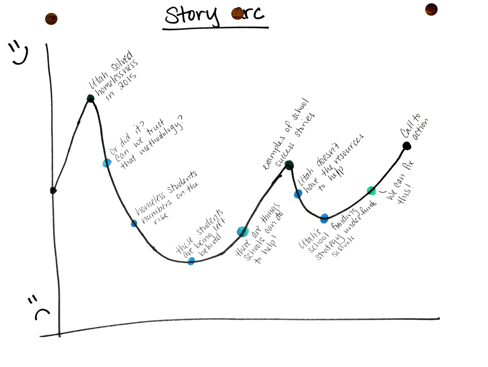

# Final Project: Sketches, Story Board, Mood Board, and Research

This week, we did a lot of the behind the scenes work on creating a narrative that would speak to our audience. I started with outlining my desired storyarc, and then moved into sketching out the different screens in my storymap. Next, I collected items for my mood board, played around with some graphs, and interviewed some people from Utah to get their perspective on the narrative. 

## Step 1: Story arc and sketches
 

Starting from this story arc, I created a set of sketches that would mimic the different screens in my story map. My sketches are <a href="Scan Feb 18, 2019.pdf">here</a>.

<embed src="Scan Feb 18, 2019.pdf" width=720 height=1280 />

#
