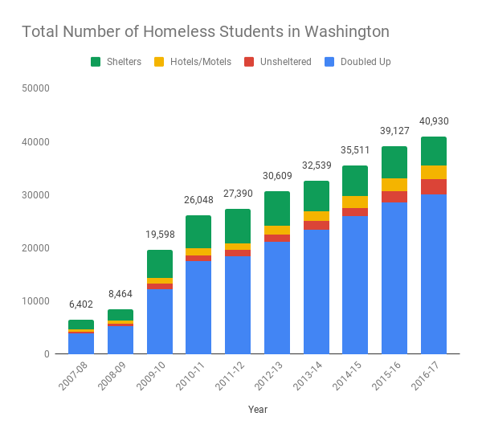

# Portfolio
This is my portfolio for Telling Stories with Data.

## About Me:
I am a MSPPM student from Hawaii who has found a passion for data analysis and coding. I am interested in housing security, homelessness, and affordable housing options. When I graduate, I hope to do data analysis for the management team of an organization. 

## What I Hope to Learn:
I hope to learn about how to make data visually compelling and meaningful for a target audience. I want to make data beautiful and interesting, easy to understand and action-invoking. I am excited to learn various tools to create visuals, and get a portfolio together to share my work with any interested parties. 

## Portfolio:
### Week 2 Homework:<a href="VizAssignment1"> Visualizing Total National Debt for OECD countries from 1996 to 2017</a>

### Week 3: Critiquing and recreating a visualization
This week, we chose a visualization to critique and recreate using the things we learned in the class so far. For my visualization, I chose a report about student homelessness in Washington State. The <a href = "https://schoolhousewa.org/data/analysis/about-one-in-every-25-k-12-students-in-our-state-is-homeless/"> report, written by SchoolHouse Washington</a>, was a fact sheet about student homelessness in the state and was intended for for an audience of practitioners, policy makers, and the public. The article addressed its points concisely while referencing sources along the way so it could be a useful reference. I chose this the visualizations in this report because while the report was concise, the visualizations were not. The report wanted to address both the number of homeless students and the proportion of students in each type of primary nighttime housing situation. I felt that this graph could have been more succinct, cutting out the need for two sections.

I quickly created a plug and play stacked bar chart using Infogr.am, with the same data as the report. I also created a stacked area chart with the same information and data. These mock-ups can be found <a href = "https://infogram.com/number-of-homeless-students-in-washington-1h7g6k5j5k7j6oy?live">here</a>. Unfortunately, the graph I created did not test well with my audience. While they liked the stacked bar chart design, it was hard for them to quickly assess the numbers they needed to understand the weight of the situation. I wanted to add totals to the top of each bar, but Infogr.am lacked that functionality in the basic package. So I turned instead to Google Sheets as a way to create my graph. While the colors were more difficult to manipulate and the interface was not quite as aesthetically pleasing, the ability to add totals to my design increased the test audience usability of the graph. Since the second graph more accurately conveyed my intent, I decided that would be my final product. 

